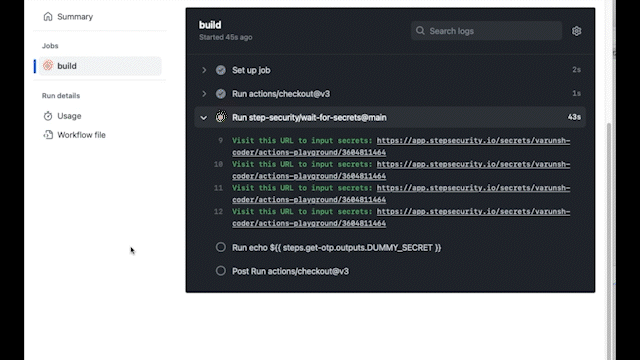

<p align="center"></p>

<div align="center">

[](https://stepsecurity.io/?utm_source=github&utm_medium=organic_oss&utm_campaign=wait-for-secrets)
[](https://api.securityscorecards.dev/projects/github.com/step-security/wait-for-secrets)
[](https://raw.githubusercontent.com/step-security/wait-for-secrets/main/LICENSE)

</div>

---

Publish from GitHub Actions using multi-factor authentication. Wait-for-secrets GitHub Action waits for the developer to enter secrets during a workflow run. Developers can enter secrets using a web browser and use them in the workflow.

<p align="center">
  
</p>

## Why?

- **MFA** To enable using multi-factor authentication (MFA)/ one-time password (OTPs) for a release workflow, e.g., use OTP to publish to the npm registry.
- **Separation of duties** Even if someone has write access to the repository, they do not get access to the deployment secrets.
- **More control** You have more control over _when_ secrets get used in your workflows. With `wait-for-secrets,` there is manual human interaction needed for publishing.
- **Less management overhead** You can use your existing account for deployment. This removes the need to manage a separate set of deployment credentials.

## How?

1. Add the `wait-for-secrets` GitHub Action to your workflow and specify the secrets you need.
2. The Action will print a URL in the build log every 10 seconds and wait for you to enter the secrets
3. Click on the URL and enter the secrets that the workflow needs.
4. The Action will get the secrets you entered in the browser and continue execution.
5. Use the retrieved secrets in future steps.

### Demo workflow

Use this workflow to see a quick demo of `wait-for-secrets` with a dummy secret.

``` yaml
name: Wait-for-secrets Demo
on:
  workflow_dispatch
  
jobs:
  build:
    permissions:
      id-token: write
    runs-on: ubuntu-latest
    steps:
      - uses: actions/checkout@v3
      - uses: step-security/wait-for-secrets@v1
        id: get-otp
        with:
          secrets: |
            DUMMY_SECRET: 
              name: 'Dummy secret'
              description: 'Dummy secret to demo wait-for-secrets'
      - run: | 
          echo ${{ steps.get-otp.outputs.DUMMY_SECRET }}
```

### Publish to NPM registry using one-time password (OTP)

Use this workflow to publish to the npm registry using a one-time password.

Prerequisites:

1. Setup [two-factor authentication](https://docs.npmjs.com/configuring-two-factor-authentication) for your account.
2. Require two-factor authentication to publish the package. This can be [configured in the package settings](https://docs.npmjs.com/requiring-2fa-for-package-publishing-and-settings-modification).
3. Create a `Publish` [access token](https://docs.npmjs.com/creating-and-viewing-access-tokens) and set it as a GitHub secret `NODE_AUTH_TOKEN`

```yaml
name: Publish Package to npmjs
on: workflow_dispatch

permissions:
  contents: read

jobs:
  build:
    runs-on: ubuntu-latest
    permissions:
      contents: read
      id-token: write
    steps:
      - uses: actions/checkout@v3
      - uses: actions/setup-node@v3
        with:
          node-version: "16.x"
          registry-url: "https://registry.npmjs.org"
      - uses: step-security/wait-for-secrets@v1
        id: wait-for-secrets
        with:
          secrets: |
            OTP: 
              name: 'OTP to publish package'
              description: 'OTP from authenticator app'
      - run: npm ci
      - run: npm publish --otp ${{ steps.wait-for-secrets.outputs.OTP }}
        env:
          NODE_AUTH_TOKEN: ${{ secrets.NODE_AUTH_TOKEN }}
```

When you run this workflow, you will see a link in the build log to enter the OTP.

- Click on the link and enter the OTP.
- The workflow will take the OTP and pass it to the `npm publish` step.
- OTP will be used to publish the package.

### Slack notification

You can get a notification on Slack when the secret needs to be entered. Set the `slack-webhook-url` as shown below.

### Deploy to AWS using temporary security credentials

Example of how to provide AWS temporary security credentials in a workflow.

```yaml
name: Deploy to AWS

on:
  workflow_dispatch:
  push:
    branches:
      - main

permissions:
  contents: read

jobs:
  publish:
    permissions:
      contents: read
      id-token: write
    runs-on: ubuntu-latest
    steps:
      - name: Checkout
        uses: actions/checkout@v3

      - uses: step-security/wait-for-secrets@v1
        id: wait-for-secrets
        with:
          slack-webhook-url: ${{ secrets.SLACK_WEBHOOK_URL }}
          secrets: |
            AWS_ACCESS_KEY_ID: 
              name: 'AWS access key id'
              description: 'Access key id for prod'
            AWS_SECRET_ACCESS_KEY:
              name: 'AWS secret access key'
              description: 'Secret access key for prod'
            AWS_SESSION_TOKEN:
              name: 'AWS session token'
              description: 'Session token for prod'

      - name: Configure AWS Credentials
        uses: aws-actions/configure-aws-credentials@v1
        with:
          aws-access-key-id: ${{ steps.wait-for-secrets.outputs.AWS_ACCESS_KEY_ID }}
          aws-secret-access-key: ${{ steps.wait-for-secrets.outputs.AWS_SECRET_ACCESS_KEY }}
          aws-session-token: ${{ steps.wait-for-secrets.outputs.AWS_SESSION_TOKEN }}
          aws-region: us-west-2
```

During the workflow run, you can generate temporary AWS credentials for your account and enter them using the browser.

### How does `wait-for-secrets` work?

[To be added]

### Actual examples

Here are a couple of workflows that use `wait-for-secrets`

1. Publish to NPM: https://github.com/jsx-eslint/eslint-plugin-react/blob/master/.github/workflows/npm-publish.yml
2. Deploy to AWS: https://github.com/step-security/secure-workflows/blob/main/.github/workflows/release.yml
3. GitHub release: https://github.com/step-security/wait-for-secrets/blob/main/.github/workflows/release.yml

### FAQ

1. Why does `wait-for-secrets` need `id-token: write` permission?

   It needs the `id-token: write` permission to authenticate to the StepSecurity API. This is to ensure only the authorized workflow can retrieve the secrets.

2. Where is the code for the StepSecurity API?

   `Wait-for-secrets` GitHub Action and the backend API it uses are open-source. The backend API is in the [https://github.com/step-security/secure-workflows](https://github.com/step-security/secure-workflows/tree/main/remediation/secrets) repository.
